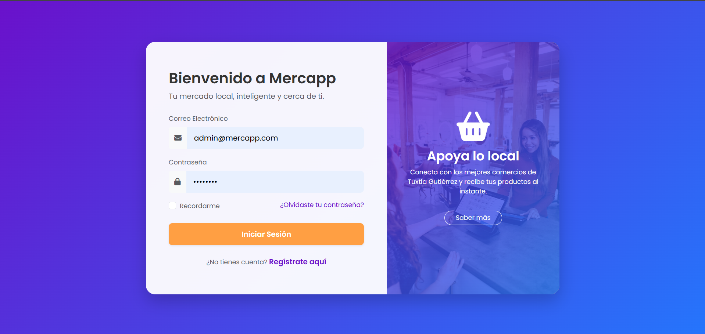
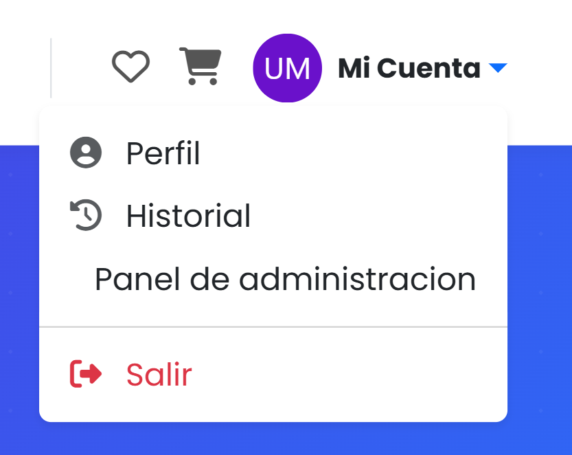
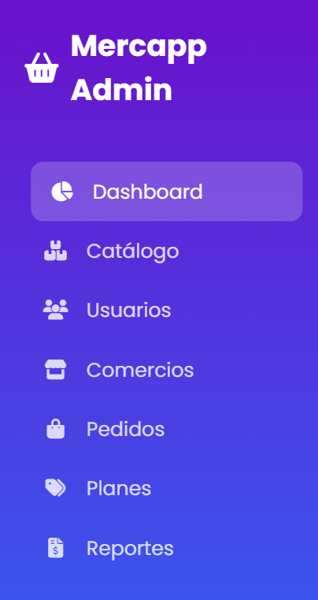
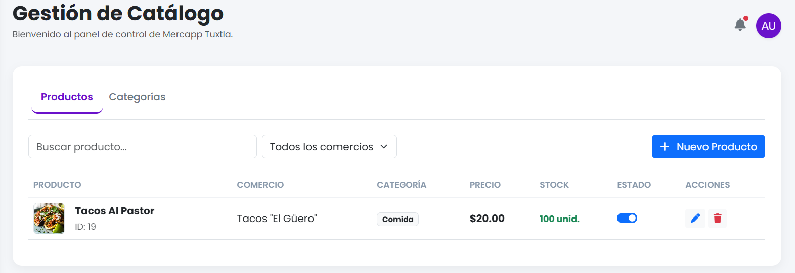
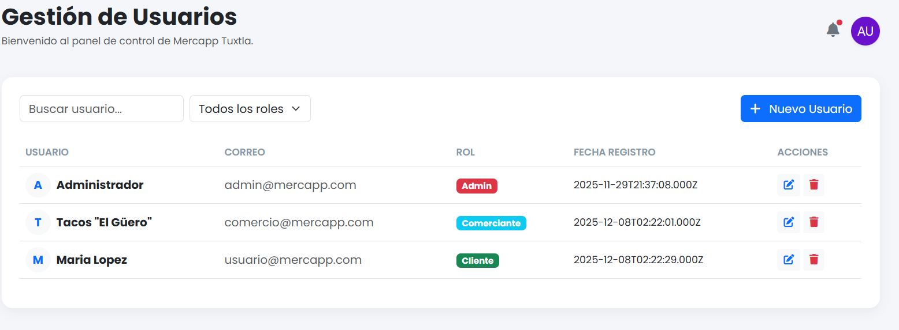
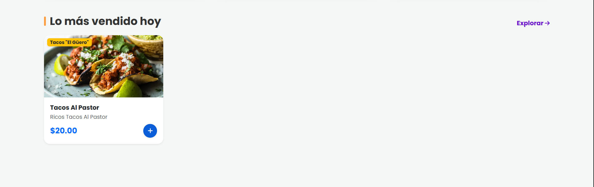
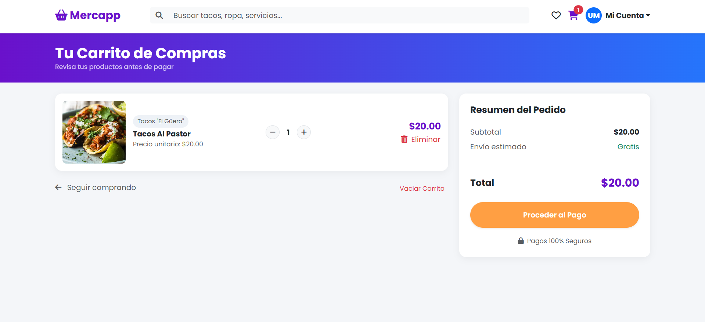

Pasos para ejercutar y usar la aplicacion.

1. Entrar al directorio backend/src
2. Ejecutar en el CMD el comando node app.js
3. Entrar al enlace http://localhost:3000/
4. Ingresar con las siguientes credenciales
    correo: admin@mercapp.com
    contraseña: password
    
5. Se mostrara la pagina princiapl. En la parte superior del menu de navegacion dar clic en "mi cuenta">"panel de administracion"

6. Una vez en el dashboard principal, en la parte izquierda aparece los menus de "Catalogo" y "Usuarios" (Los dos unicos apartados con funcionalidad)

7. En el apartado de catalogo vienen dos menus, uno de productos y otro de categorias. Para agregar un nuevo producto dar clic en el boton.Al igual que para agregar una nueva categoria dar clic en el boton. Cabe aclarar que existen categorias padres y subcategorias, las categorias padres no se pueden modificar ni eliminar, las subcategorias si.

8. Para la parte de usuarios se puede agregar, eliminar y editar.

9. Una vez se hayan agregado los productos, ir al home de nuevo dando clic en la parte superior izquierda, irse a la parte de abajo donde apareceran los productos para agregar al carrito

10. Una vez agregado todos los productos, en la parte superior aparece el icono de carrito, dar clic para ir al carrito de compras
11. Una vez ahi en la pagina del carrito, apareceran los productos y se podran agregar mas de esos productos
